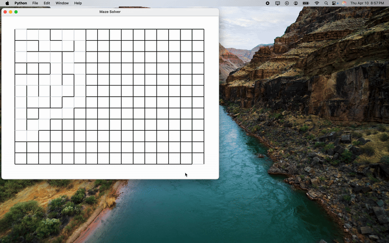

# Maze Solver

This repository contains a Python-based Maze Solver application that uses Tkinter for GUI rendering and a Depth-First Search (DFS) algorithm to navigate through a maze. The solving process is animated using `maze_demo.gif`.

## Features

- Implements Depth-First Search algorithm to solve the maze
- Renders the maze using a Tkinter graphical interface
- Visualizes the maze creation and solving process step by step
- Includes `maze_demo.gif` to demonstrate the solution animation


## How to Use

Clone the repository and run the main script:

```bash
git clone https://github.com/manonmission88/MazeSolver.git
cd MazeSolver
python main.py
```

This will launch the Tkinter window and animate the maze-solving process.

## Demo




## File Structure

```
MazeSolver/
├── main.py             # Main script to run the solver
├── maze_solver.py      # Contains the DFS maze-solving logic
├── window.py           # Handles the Tkinter window
├── cell.py             # Defines individual cell behavior
├── maze_demo.gif       # Animated demonstration of the maze solver
└── README.md           # Project documentation
```

## Resource - boot.dev 

